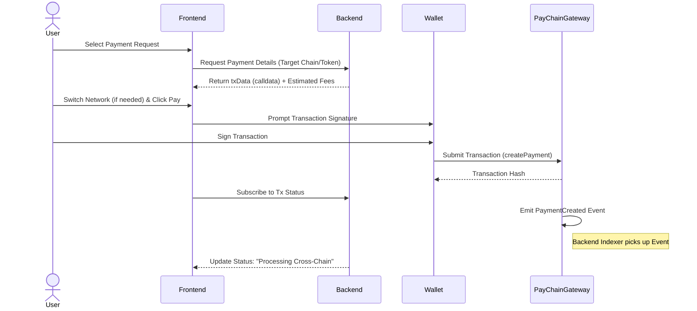
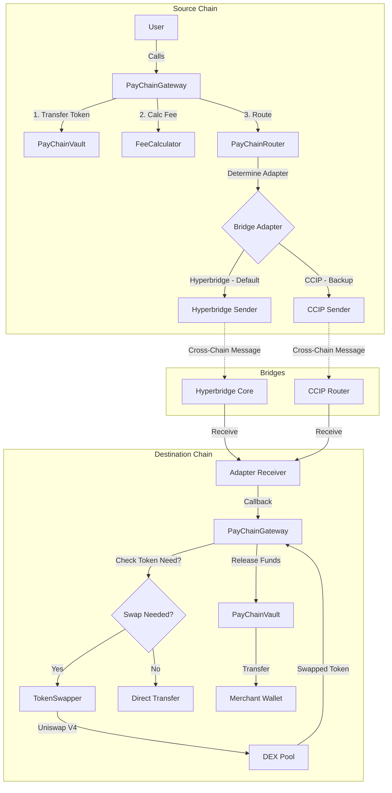
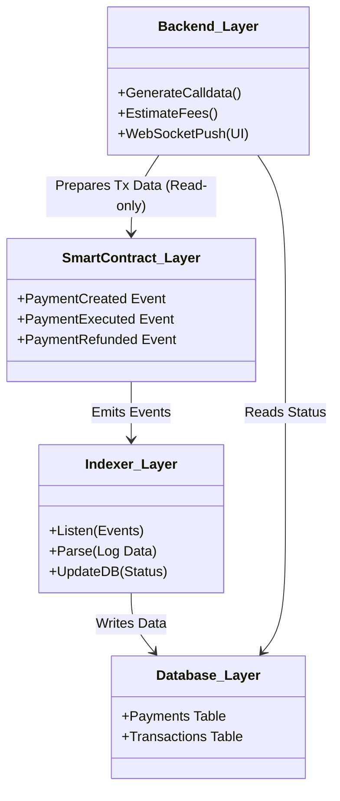
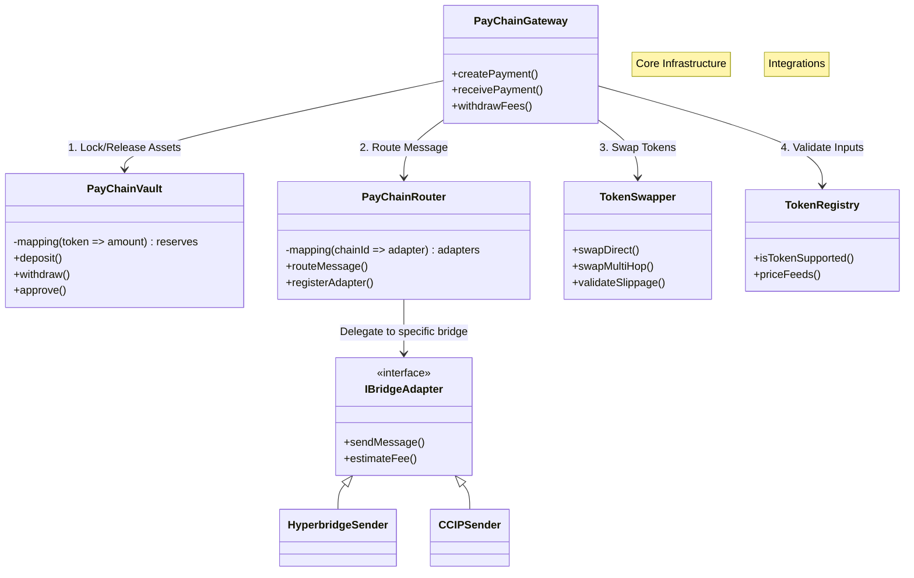

# Pay-Chain EVM Smart Contracts - Product Requirements Document

> **Component**: EVM Smart Contracts  
> **Status**: Implementation In Progress  
> **Framework**: Foundry

## 1. Overview

The **Pay-Chain EVM Smart Contracts** module acts as the secure execution layer for the cross-chain stablecoin payment gateway. It handles asset custody, cross-chain message routing, atomic token swaps via DEXs, and fee management.

### Key Objectives
1.  **Trustless Execution**: No hidden admin backdoors for moving user funds (except strictly defined emergency pauses).
2.  **Asset Agnosticism**: Accept any ERC20 (USDC, USDT, WETH) and swap to the target currency automatically.
3.  **Fail-Safe Mechanism**: Guaranteed 100% principal refund if the cross-chain transaction cannot be delivered.
4.  **Modular Architecture**: Pluggable "Adapters" for different bridges (Hyperbridge, CCIP) to avoid vendor lock-in.

---

## 2. Workflow Diagrams

### 2.1 User Flow
How the user interacts with the system from the frontend through to blockchain confirmation.



### 2.2 Payment Flow
The lifecycle of a payment from source chain execution to destination chain settlement.



### 2.3 Application Flow
How the smart contracts interact with off-chain components (Backend, Indexer).



---

## 3. System Architecture

The system uses a **Hub-and-Spoke** model. The `PayChainGateway` is the central "Hub" that coordinates all actions, while logic is delegated to specialized "Spokes" (Vault, Router, Swapper).



---

## 4. Detailed Component Specifications

### 4.1 PayChainGateway (`PayChainGateway.sol`)
The primary entry point for all interactions.

**State Variables:**
- `address public vault`: Address of the PayChainVault.
- `address public router`: Address of the PayChainRouter.
- `address public registry`: Address of the TokenRegistry.
- `address public swapper`: Address of the TokenSwapper.
- `address public feeRecipient`: Wallet to receive protocol fees.
- `uint256 public constant BASE_BPS = 10000`: Basis points divisor.

**Core Functions:**

| Function | Visibility | Description |
| :--- | :--- | :--- |
| `createPayment(...)` | `external payable` | Initiates a cross-chain payment. Deducts fees, locks funds in Vault, and calls Router. |
| `createPaymentWithSlippage(...)` | `external payable` | Same as above but defines minimum output amount for swaps. |
| `receivePayment(...)` | `external` | Callback from Router/Adapters when a message lands on this chain. Unlocks funds or triggers swaps. |
| `retryFailedPayment(...)` | `external` | Allows manual retry of a failed local execution (e.g., if receiver reverts). |

**Failure Handling:**
If `receivePayment` fails (e.g., receiver blacklist, swap fail):
1.  The contract **MUST NOT REVERT** completely (to avoid bridge locking).
2.  It MUST emit a `PaymentFailed` event.
3.  Funds stay in the Vault, marked as "Refundable" or "Retryable" for the sender/receiver.

### 4.2 PayChainVault (`PayChainVault.sol`)
Holds all user and protocol assets. Logic-less to minimize attack surface.

**Security:**
- `AccessControl`: Only `GATEWAY_ROLE` and `SPENDER_ROLE` can trigger withdrawals.
- `withdraw(token, to, amount)`: Moves funds.
- `approve(token, spender, amount)`: Approves DEX router or Bridge to spend tokens.

### 4.3 PayChainRouter (`PayChainRouter.sol`)
Routes messages based on destination chain ID and bridge preference.

**Routing Logic:**
1.  User specifies `bridgeType` (0 = Hyperbridge [Default], 1 = CCIP, etc.) or uses Default config.
2.  Router looks up `adapter[destinationChainId][bridgeType]`.
3.  Router calls `adapter.sendMessage{value: fee}(...)`.

**Bridge Priority:**
- **Primary (Type 0)**: **Hyperbridge** (Low cost, Polkadot security).
- **Secondary (Type 1)**: **Chainlink CCIP** (Premium cost, high security).

### 4.4 TokenSwapper (`TokenSwapper.sol`)
Handles interaction with Uniswap V4.

**Features:**
- **PoolKey Construction**: Automatically determines pool parameters (fee, tickSpacing).
- **Universal Router**: Uses `V4_SWAP` commands for multi-hop execution.
- **Slippage**: Reverts if `amountOut < minAmountOut`.

---

## 5. Fee Model

The protocol charges a fee on top of the transaction amount to cover operational costs and generate revenue.

**Formula:**
$$
\text{Total Charge} = \text{Amount} + \text{Protocol Fee} + \text{Bridge Fee}
$$

1.  **Protocol Fee**:
    - `max(Fixed Fee, Percentage Fee)`
    - Example: `max($0.50, 0.1%)`.
    - Configured per token/chain in `feeCalculator`.

2.  **Bridge Fee**:
    - The actual gas cost charged by CCIP or Hyperbridge to deliver the message.
    - Paid by the sender in Native Token (ETH/BNB/MATIC) or bonded token.

---

## 6. Events for Indexer

The `PayChain.indexer` service listens for these specific events to update the database.

**PaymentCreated**
```solidity
event PaymentCreated(
    bytes32 indexed paymentId,
    address indexed sender,
    bytes32 indexed requestHash, // Links to backend PaymentRequest
    string destChainId,
    address sourceToken,
    uint256 amount,
    uint256 fee,
    string bridgeType // "Hyperbridge" or "CCIP"
);
```

**PaymentExecuted** (On Destination Chain)
```solidity
event PaymentExecuted(
    bytes32 indexed paymentId,
    address indexed receiver,
    address destToken,
    uint256 amountReceived
);
```

**PaymentRefunded**
```solidity
event PaymentRefunded(
    bytes32 indexed paymentId,
    address indexed receiver,
    uint256 amount,
    string reason
);
```

---

## 7. Integration Adapters

### 7.1 Hyperbridge (Primary)
- **Sender**: `HyperbridgeSender.sol` interacts with `IDispatcher`.
- **Receiver**: `HyperbridgeReceiver.sol` verifies merkle proofs (if applicable for specific host implementation) or handles `onMessage`.
- **Cost**: Low (Polkadot Storage Proofs).

### 7.2 Chainlink CCIP (Secondary)
- **Sender**: `CCIPSender.sol` encodes `EVM2AnyMessage`.
- **Receiver**: `CCIPReceiver.sol` implements `CCIPReceiver` abstract class.
- **Security**: Uses `Client.EVMTokenAmount` for token handling.

---

## 8. Development & Deployment

### Directory Structure
- `src/`: Smart contracts source code.
- `script/`: Deployment scripts (`DeployBase.s.sol`, `DeployBSC.s.sol`, etc.).
- `test/`: Foundry tests.

### Configuration (`.env`)
See `.env.example`. Required keys:
- `PRIVATE_KEY`: Deployer wallet.
- `*_RPC_URL`: RPC endpoints for targeted chains.
- `*_CCIP_ROUTER`: Chainlink Router addresses.
- `UNISWAP_POOL_MANAGER`: V4 Pool Manager address.

### Deployment Commands

**Prerequisites:**
1.  Ensure `.env` is configured with `BASE_USDC` (or equivalent stablecoin address).
2.  The deployment script **Validation** will fail if no bridge token is provided, ensuring Mainnet safety.

**1. Base (Sepolia/Mainnet)**
```bash
forge script script/DeployBase.s.sol --rpc-url $BASE_RPC_URL --broadcast --verify --etherscan-api-key $BASESCAN_API_KEY
```

**2. BSC (Testnet/Mainnet)**
```bash
forge script script/DeployBSC.s.sol --rpc-url $BSC_RPC_URL --broadcast --verify --etherscan-api-key $BSCSCAN_API_KEY
```

### Post-Deployment Verification
After deployment, the script:
1.  Deploys `TokenRegistry`, `Vault`, `Router`, `Gateway`.
2.  **Validates** that a generic Stablecoin address is provided.
3.  **Automatically registers** the bridge token in `TokenRegistry` (so `createPayment` works immediately).
4.  Sets up `Vault` permissions.

To add more supported tokens manually:
```bash
cast send --rpc-url <URL> <REGISTRY_ADDR> "setTokenSupport(address,bool)" <TOKEN_ADDR> true --private-key <KEY>
```

---

## 9. Test Coverage

We strictly adhere to "Extreme Unit Testing" principles.

| Test Suite | Focus | Status |
| :--- | :--- | :--- |
| `PayChainGatewayTest` | End-to-end flow (Create -> Receive). | ✅ Passing |
| `TokenSwapperV4Test` | Uniswap V4 integration, slippage, path, fuzzing. | ✅ Passing |
| `PayChainVaultTest` | Access control, asset safety. | ✅ Passing |
| `FeeCalculatorTest` | Math accuracy for fee computation. | ✅ Passing |

Run all tests:
```bash
forge test
```
