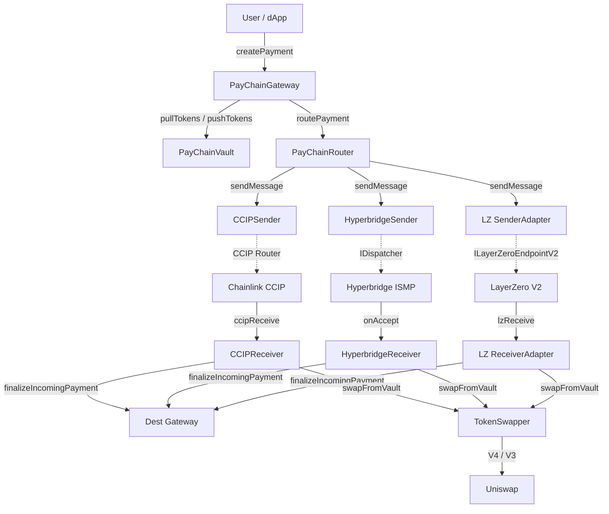

# PayChain Smart Contract Integration Analysis

> **Scope**: Deep end-to-end analysis of CCIP, Hyperbridge, LayerZero V2, and Uniswap V4/V3 integrations compared against official reference implementations.

---

## 1. Architecture Overview



| Component | File | Lines | Role |
|-----------|------|-------|------|
| Gateway | [PayChainGateway.sol](file:///Users/staffinc/Documents/Development/pay-chain/pay-chain.evm.smartcontract/src/PayChainGateway.sol) | 543 | Entry point, fee calc, S1-S5 orchestration |
| Router | [PayChainRouter.sol](file:///Users/staffinc/Documents/Development/pay-chain/pay-chain.evm.smartcontract/src/PayChainRouter.sol) | 193 | Adapter registry, message routing |
| Vault | [PayChainVault.sol](file:///Users/staffinc/Documents/Development/pay-chain/pay-chain.evm.smartcontract/src/vaults/PayChainVault.sol) | 127 | Custody, pull/push token ops |
| Swapper | [TokenSwapper.sol](file:///Users/staffinc/Documents/Development/pay-chain/pay-chain.evm.smartcontract/src/TokenSwapper.sol) | 651 | Uniswap V4/V3 swap execution |
| Bridge Interface | [IBridgeAdapter.sol](file:///Users/staffinc/Documents/Development/pay-chain/pay-chain.evm.smartcontract/src/interfaces/IBridgeAdapter.sol) | 58 | Standard adapter interface |

### Bridge Mode Design

[PayChainRouter L21-22](file:///Users/staffinc/Documents/Development/pay-chain/pay-chain.evm.smartcontract/src/PayChainRouter.sol#L21-L22): Two modes:
- **`MESSAGE_LIQUIDITY`** — Messages only; tokens locked source-side, released from dest vault (Hyperbridge, LayerZero)
- **`TOKEN_BRIDGE`** — Physical token transfer via bridge (CCIP with token support)

---

## 2. Payment Flow Verification (S1–S5)

All 5 scenarios traced through [PayChainGateway._createPaymentInternal](file:///Users/staffinc/Documents/Development/pay-chain/pay-chain.evm.smartcontract/src/PayChainGateway.sol#L166-L306):

| Scenario | Same Chain? | Same Token? | Code Path | Status |
|----------|-------------|-------------|-----------|--------|
| **S1** Same Chain / Same Token | ✅ | ✅ | [L231-234](file:///Users/staffinc/Documents/Development/pay-chain/pay-chain.evm.smartcontract/src/PayChainGateway.sol#L231-L234): `vault.pushTokens(sourceToken, receiver, amount)` | ✅ Correct |
| **S2** Same Chain / Diff Token | ✅ | ❌ | [L235-246](file:///Users/staffinc/Documents/Development/pay-chain/pay-chain.evm.smartcontract/src/PayChainGateway.sol#L235-L246): `IVaultSwapper.swapFromVault()` | ✅ Correct |
| **S3** Cross-Chain / Same Token | ❌ | ✅ | [L264-293](file:///Users/staffinc/Documents/Development/pay-chain/pay-chain.evm.smartcontract/src/PayChainGateway.sol#L264-L293): `router.routePayment()` | ✅ Correct |
| **S4** Cross-Chain / Dest Swap | ❌ | ❌ | [L264-293](file:///Users/staffinc/Documents/Development/pay-chain/pay-chain.evm.smartcontract/src/PayChainGateway.sol#L264-L293): Bridge msg with `destToken ≠ sourceToken`, receiver does swap | ✅ Correct |
| **S5** Cross-Chain / Source Swap | ❌ | ❌ | [L276-288](file:///Users/staffinc/Documents/Development/pay-chain/pay-chain.evm.smartcontract/src/PayChainGateway.sol#L276-L288): Pre-bridge swap when `enableSourceSideSwap=true` | ✅ Correct |

> [!NOTE]
> S5 swaps `sourceToken → destToken` in the source vault **before** bridging, then updates `message.sourceToken = destToken` and `message.amount = bridgeAmount`. This ensures the bridge carries the already-converted token.

---

## 3. CCIP Integration Analysis

### 3.1 Sender: [CCIPSender.sol](file:///Users/staffinc/Documents/Development/pay-chain/pay-chain.evm.smartcontract/src/integrations/ccip/CCIPSender.sol) (176 lines)

**Reference**: [ProgrammableTokenTransfers.sol](file:///Users/staffinc/Documents/Development/web3/ccip-defi-lending/contracts/ProgrammableTokenTransfers.sol), [BasicTokenSender.sol](file:///Users/staffinc/Documents/Development/web3/ccip-starter-kit-foundry/src/BasicTokenSender.sol)

| Aspect | PayChain | Reference | Verdict |
|--------|----------|-----------|---------|
| Message struct | `Client.EVM2AnyMessage` | Same | ✅ |
| Extra args | `Client.EVMExtraArgsV2` (gasLimit + strict=false) | V1 in older refs, V2 in newer | ✅ Better |
| Fee payment | Native `msg.value` | Both native + LINK shown | ✅ Standard |
| Token handling | Vault approves CCIP router, includes `Client.EVMTokenAmount[]` | Same pattern | ✅ |
| Payload encoding | `abi.encode(paymentId, destToken, receiver, minAmountOut, sourceToken)` | App-specific | ✅ |
| Route config | `destChainSelectors` + `destinationContracts` mappings | Same | ✅ |

> [!TIP]
> PayChain's use of `EVMExtraArgsV2` is forward-looking. The `allowOutOfOrderExecution = false` default ensures message ordering.

### 3.2 Receiver: [CCIPReceiver.sol](file:///Users/staffinc/Documents/Development/pay-chain/pay-chain.evm.smartcontract/src/integrations/ccip/CCIPReceiver.sol) (152 lines)

**Base**: [CCIPReceiverBase.sol](file:///Users/staffinc/Documents/Development/pay-chain/pay-chain.evm.smartcontract/src/integrations/ccip/CCIPReceiverBase.sol) — custom `IAny2EVMMessageReceiver` + `onlyRouter` guard.

| Aspect | PayChain | Reference | Verdict |
|--------|----------|-----------|---------|
| Router guard | `onlyRouter` modifier via `CCIPReceiverBase` | Same (`onlyRouter`) | ✅ |
| Source chain trust | `allowedSourceChains[selector]` mapping | Same | ✅ |
| Sender trust | `keccak256(message.sender) != keccak256(trusted)` | Same approach | ✅ |
| Token extraction | `message.destTokenAmounts[0]` | `destTokenAmounts` | ✅ |
| Dest-side swap | Calls `TokenSwapper.swapFromVault()` when `destToken ≠ bridgedToken` | App-specific | ✅ |

> [!IMPORTANT]
> **Finding CCIP-1: Payload Decode/Encode Consistency**
> 
> - **Sender** encodes: `abi.encode(paymentId, destToken, receiver, minAmountOut, sourceToken)` — [CCIPSender L121](file:///Users/staffinc/Documents/Development/pay-chain/pay-chain.evm.smartcontract/src/integrations/ccip/CCIPSender.sol#L121)
> - **Receiver** decodes: `abi.decode(message.data, (bytes32, address, address, uint256, address))` which maps to `(paymentId, destToken, receiver, minAmountOut, sourceToken)` — [CCIPReceiver L82-83](file:///Users/staffinc/Documents/Development/pay-chain/pay-chain.evm.smartcontract/src/integrations/ccip/CCIPReceiver.sol#L82-L83)
> 
> The field order **is consistent**. Both encode/decode in the same order. ✅ Verified correct.

---

## 4. Hyperbridge Integration Analysis

### 4.1 Sender: [HyperbridgeSender.sol](file:///Users/staffinc/Documents/Development/pay-chain/pay-chain.evm.smartcontract/src/integrations/hyperbridge/HyperbridgeSender.sol) (275 lines)

**Reference**: [TokenGateway.sol](file:///Users/staffinc/Documents/Development/web3/hyperbridge/hyperbridge/evm/src/modules/TokenGateway.sol), [PingModule.sol](file:///Users/staffinc/Documents/Development/web3/hyperbridge/hyperbridge/evm/src/utils/PingModule.sol)

| Aspect | PayChain | Reference | Verdict |
|--------|----------|-----------|---------|
| Dispatch method | `IDispatcher(host()).dispatch(post)` | `host.dispatch(post)` | ✅ |
| Fee mechanism | Queries `perByteFee`, converts via Uniswap V2, pays in native | `host.hostParams().perByteFee` + `IUniswapV2Router` | ✅ Matches ref |
| Payload format | `abi.encode(paymentId, receiver, destToken, amount, minAmountOut, sourceToken)` | App-specific | ✅ |
| Timeout | Configurable `HYPERBRIDGE_TIMEOUT` | `60 * 60` in PingModule | ✅ |
| Token model | **MESSAGE_LIQUIDITY** — tokens stay locked in vault | TokenGateway uses lock/mint | ⚠️ Design choice |

> [!NOTE]
> PayChain intentionally uses MESSAGE_LIQUIDITY (not lock/mint). Source vault locks tokens; destination vault releases equivalent tokens. This requires pre-funded destination vaults but avoids bridge-minted synthetics.

### 4.2 Receiver: [HyperbridgeReceiver.sol](file:///Users/staffinc/Documents/Development/pay-chain/pay-chain.evm.smartcontract/src/integrations/hyperbridge/HyperbridgeReceiver.sol) (163 lines)

**Reference**: [PingModule.sol](file:///Users/staffinc/Documents/Development/web3/hyperbridge/hyperbridge/evm/src/utils/PingModule.sol) extends `HyperApp` which uses `onlyHost` modifier.

| Aspect | PayChain | Reference | Verdict |
|--------|----------|-----------|---------|
| Host verification | `require(msg.sender == address(host()), "Not host")` | `modifier onlyHost` | ⚠️ See HB-1 |
| Trusted sender check | Hash-based: `keccak256(request.source)` → `trustedSenders` | Not in basic refs | ✅ Extra security |
| Dest-side swap | `TokenSwapper.swapFromVault()` when `destToken ≠ sourceToken` | N/A (app-specific) | ✅ |
| Timeout handler | `onPostRequestTimeout()` — emits event, calls `gateway.markPaymentFailed()` | Ref: dispatches refund response | ⚠️ See HB-2 |

> [!WARNING]
> **Finding HB-1: Manual Host Check vs `onlyHost` Modifier**
> 
> [HyperbridgeReceiver L73](file:///Users/staffinc/Documents/Development/pay-chain/pay-chain.evm.smartcontract/src/integrations/hyperbridge/HyperbridgeReceiver.sol#L73) uses:
> ```solidity
> require(msg.sender == address(host()), "Not host");
> ```
> 
> The reference `HyperApp.sol` provides an `onlyHost` modifier. While functionally equivalent, using the official modifier ensures forward-compatibility with ISMP protocol changes. **Risk: Low.** The check is correct but fragile.

> [!WARNING]
> **Finding HB-2: Timeout Handler Doesn't Refund Tokens**
> 
> [HyperbridgeReceiver.onPostRequestTimeout](file:///Users/staffinc/Documents/Development/pay-chain/pay-chain.evm.smartcontract/src/integrations/hyperbridge/HyperbridgeReceiver.sol#L140-L163) emits an event and marks the payment as failed, but **tokens remain locked in the source vault**. Users must separately call `PayChainGateway.processRefund()` to recover funds.
> 
> Reference [TokenGateway.sol](file:///Users/staffinc/Documents/Development/web3/hyperbridge/hyperbridge/evm/src/apps/TokenGateway.sol) handles refunds atomically within the timeout callback. PayChain's two-step flow is a conscious design choice (admin-reviewable refunds) but adds user friction.

---

## 5. LayerZero V2 Integration Analysis

### 5.1 Sender: [LayerZeroSenderAdapter.sol](file:///Users/staffinc/Documents/Development/pay-chain/pay-chain.evm.smartcontract/src/integrations/layerzero/LayerZeroSenderAdapter.sol) (159 lines)

**Reference**: [OAppSender.sol](file:///Users/staffinc/Documents/Development/web3/LayerZero-v2/packages/layerzero-v2/evm/oapp/contracts/oapp/OAppSender.sol), [OAppCore.sol](file:///Users/staffinc/Documents/Development/web3/LayerZero-v2/packages/layerzero-v2/evm/oapp/contracts/oapp/OAppCore.sol)

| Aspect | PayChain | Reference (`OAppSender`) | Verdict |
|--------|----------|--------------------------|---------|
| Endpoint interaction | Direct `endpoint.send()` | `endpoint.send()` via `_lzSend()` helper | ✅ Equivalent |
| Options format | Type 3 options built manually | `OptionsBuilder` library | ⚠️ See LZ-1 |
| Peer management | `destinationPeers[eid]` mapping | `peers[eid]` in `OAppCore` | ⚠️ Different naming |
| Fee quoting | `endpoint.quote()` | `_quote()` wrapper | ✅ Same underlying |
| Payload | `abi.encode(paymentId, destToken, receiver, amount, minAmountOut, sourceToken)` | App-specific | ✅ |

> [!NOTE]
> **Finding LZ-1: Manual Options Construction**
> 
> PayChain manually builds Type 3 options bytes instead of using LayerZero's `OptionsBuilder` library. This works but requires manual maintenance when LZ adds new options types. Current implementation constructs `executorGasLimit` options correctly.

### 5.2 Receiver: [LayerZeroReceiverAdapter.sol](file:///Users/staffinc/Documents/Development/pay-chain/pay-chain.evm.smartcontract/src/integrations/layerzero/LayerZeroReceiverAdapter.sol) (190 lines)

**Reference**: [OAppReceiver.sol](file:///Users/staffinc/Documents/Development/web3/LayerZero-v2/packages/layerzero-v2/evm/oapp/contracts/oapp/OAppReceiver.sol), [OApp.sol](file:///Users/staffinc/Documents/Development/web3/LayerZero-v2/packages/layerzero-v2/evm/oapp/contracts/oapp/OApp.sol)

| Aspect | PayChain | Reference (`OAppReceiver`) | Verdict |
|--------|----------|-----------------------------|---------|
| Base contract | **Does NOT extend `OApp`** | Extends `OAppReceiver → OAppCore` | ⚠️ See LZ-2 |
| Endpoint guard | `msg.sender != endpoint` check | Same, in `_lzReceive` path | ✅ |
| Peer verification | `trustedPeers[srcEid]` check | `_getPeerOrRevert(srcEid)` | ⚠️ Re-implemented |
| `allowInitializePath` | Returns `trustedPeers[origin.srcEid] != bytes32(0)` | Returns `peers[srcEid] == origin.sender` | ⚠️ See LZ-3 |
| Nonce management | `receivedNonces[srcEid][sender]` tracking | Built into `OAppReceiver` | ⚠️ Re-implemented |
| `nextNonce` | Returns `receivedNonces[origin.srcEid][origin.sender] + 1` | Delegates to endpoint | ⚠️ See LZ-4 |

> [!CAUTION]
> **Finding LZ-2: Does Not Extend Official `OApp` Base**
> 
> PayChain's `LayerZeroReceiverAdapter` manually re-implements all `OApp` functionality:
> - Peer management (`trustedPeers` vs `peers`)
> - Origin verification (manual vs `_acceptNonce`)
> - Path initialization (`allowInitializePath`)
> - Nonce ordering (`nextNonce`)
> 
> **Risk: Medium-High.** If LayerZero V2 updates their endpoint contract or introduces new security features (e.g., composed message hooks, delegate patterns), PayChain won't automatically inherit them.

> [!WARNING]
> **Finding LZ-3: `allowInitializePath` Implementation Difference**
> 
> - **PayChain**: `return trustedPeers[origin.srcEid] != bytes32(0)` — allows any path where a peer is registered, regardless of sender address match.
> - **Reference OApp**: `return peers[_origin.srcEid] == _origin.sender` — requires the sender to match the registered peer.
> 
> PayChain's check is **less restrictive** — it allows the path as long as *any* peer is registered for that EID, without verifying the sender matches. The sender check later in `lzReceive` compensates for this, but the path initialization phase is weaker.

> [!WARNING]
> **Finding LZ-4: Custom Nonce Tracking**
> 
> PayChain tracks nonces manually via `receivedNonces` mapping and increments in `lzReceive`. The official `OAppReceiver` delegates nonce management to the endpoint's `_acceptNonce` function, which provides atomic nonce validation. Manual tracking could lead to edge cases if messages are retried or arrive out-of-order.

---

## 6. Uniswap V4/V3 Integration Analysis

### [TokenSwapper.sol](file:///Users/staffinc/Documents/Development/pay-chain/pay-chain.evm.smartcontract/src/TokenSwapper.sol) (651 lines)

**Reference**: [GrimSwapRouter.sol](file:///Users/staffinc/Documents/Development/web3/GrimSwap/grimswap-contracts/src/zk/GrimSwapRouter.sol) (V4 integration)

| Aspect | PayChain `TokenSwapper` | GrimSwap Reference | Verdict |
|--------|------------------------|--------------------|---------|
| V4 interface | `IUniversalRouter` + `IV4Router` | `IPoolSwapTest` (test router) | ⚠️ See UNI-1 |
| V3 fallback | ✅ Has V3 fallback via `ISwapRouter` | ❌ V4 only | ✅ Better |
| Slippage | `minAmountOut` check post-swap | No explicit check (hook-based) | ✅ Better |
| Multi-hop | ✅ `_executeMultiHopSwap` with path array | ❌ Single-hop only | ✅ Better |
| Route discovery | `findRoute()` with registered routes | Hardcoded `PoolKey` | ✅ More flexible |
| Gas estimation | `estimateSwapGas()` simulation | None | ✅ Extra feature |
| Reentrancy guard | `nonReentrant` on all entry points | None (atomic with ZK) | ✅ Better |

> [!IMPORTANT]
> **Finding UNI-1: V4 Router Interface Choice**
> 
> PayChain targets `IUniversalRouter` (the production V4 router) while GrimSwap uses `IPoolSwapTest` (development/testing router). PayChain's choice is correct for production deployments. However, `IUniversalRouter` requires command-encoded calls (`execute(bytes commands, bytes[] inputs)`), and the implementation should be verified against the Uniswap V4 `UniversalRouter` ABI once deployed to mainnet.

### Swap Integration Points

Each bridge receiver calls `swapFromVault()` for destination-side swaps (S4):

```solidity
// Pattern in all 3 receivers:
uint256 finalAmount = IVaultSwapper(address(swapper)).swapFromVault(
    bridgedToken,    // tokenIn (arrived via bridge or from vault)
    destToken,       // tokenOut (what receiver needs)
    amount,          // amountIn
    minAmountOut,    // slippage
    receiver         // final recipient
);
```

This is consistent across:
- [CCIPReceiver L99-105](file:///Users/staffinc/Documents/Development/pay-chain/pay-chain.evm.smartcontract/src/integrations/ccip/CCIPReceiver.sol#L99-L105)
- [HyperbridgeReceiver L113-119](file:///Users/staffinc/Documents/Development/pay-chain/pay-chain.evm.smartcontract/src/integrations/hyperbridge/HyperbridgeReceiver.sol#L113-L119)
- [LayerZeroReceiverAdapter L148-154](file:///Users/staffinc/Documents/Development/pay-chain/pay-chain.evm.smartcontract/src/integrations/layerzero/LayerZeroReceiverAdapter.sol#L148-L154)

---

## 7. Consolidated Findings

### By Severity

| ID | Severity | Component | Finding | Recommendation |
|----|----------|-----------|---------|----------------|
| **LZ-2** | 🔴 Medium-High | LZ Receiver | Not extending `OApp` base — misses future security features | Refactor to extend `OApp` / `OAppReceiver` |
| **LZ-3** | 🟡 Medium | LZ Receiver | `allowInitializePath` less restrictive than reference | Add sender-match check: `origin.sender == trustedPeers[origin.srcEid]` |
| **LZ-4** | 🟡 Medium | LZ Receiver | Manual nonce tracking instead of endpoint delegation | Use `_acceptNonce` from `OAppReceiver` |
| **HB-2** | 🟡 Medium | HB Receiver | Timeout handler doesn't atomically refund | Document 2-step refund flow or add auto-refund option |
| **HB-1** | 🟢 Low | HB Receiver | Manual host check vs `onlyHost` modifier | Adopt `onlyHost` from `HyperApp` |
| **LZ-1** | 🟢 Low | LZ Sender | Manual options construction | Consider `OptionsBuilder` for maintainability |
| **UNI-1** | 🟢 Low | TokenSwapper | V4 router interface needs mainnet verification | Verify against deployed `UniversalRouter` ABI |

### What's Implemented Well

| Area | Assessment |
|------|------------|
| **Adapter abstraction** | Clean `IBridgeAdapter` interface with `sendMessage`, `quoteFee`, `isRouteConfigured`, `getRouteConfig` |
| **Vault security** | `authorizedSpenders` pattern, `ReentrancyGuard`, `forceApprove` for approvals |
| **Fee calculation** | Fixed base + percentage BPS model, cleanly separated in `FeeCalculator` library |
| **S5 source-side swap** | Elegantly mutates `message.sourceToken` and `message.amount` before routing |
| **CCIP integration** | Most aligned with reference — `EVMExtraArgsV2`, proper token amounts, trusted sender checks |
| **TokenSwapper** | Most comprehensive swap handler — V4 + V3, multi-hop, gas estimation, slippage protection |
| **Failure handling** | `markPaymentFailed` → `processRefund` two-phase pattern allows admin review |
| **Diagnostics** | `quotePaymentFeeSafe`, `lastRouteError`, `getRouteConfig` for observability |

---

## 8. Recommendations

### Priority 1: LayerZero Receiver Refactor

The LayerZero receiver should extend the official `OApp` base. This would:
1. Inherit battle-tested peer management (`setPeer` / `_getPeerOrRevert`)
2. Get correct `allowInitializePath` with sender matching
3. Delegate nonce management to the endpoint
4. Automatically benefit from LZ V2 protocol upgrades

### Priority 2: Hyperbridge Timeout Refunds

Consider adding an automatic refund option in `onPostRequestTimeout`:
```solidity
function onPostRequestTimeout(PostRequest memory request) external {
    require(msg.sender == address(host()), "Not host");
    // ... decode paymentId ...
    gateway.markPaymentFailed(paymentId, "Bridge timeout");
    
    // Optional auto-refund if configured
    if (autoRefundOnTimeout) {
        gateway.processRefund(paymentId);
    }
}
```

### Priority 3: Test Coverage

No project-specific test files (`*.t.sol`) were found. Critical paths to test:
1. Payload encode/decode roundtrip for each bridge
2. `allowInitializePath` edge cases for LZ
3. Swap failure handling (what if `swapFromVault` reverts on dest?)
4. `processRefund` with various payment states
5. Reentrancy scenarios on vault operations